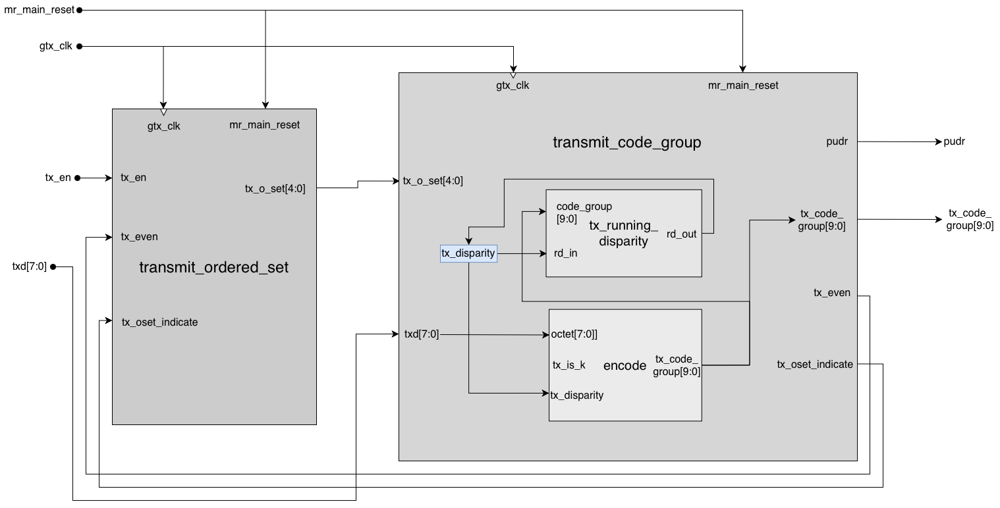
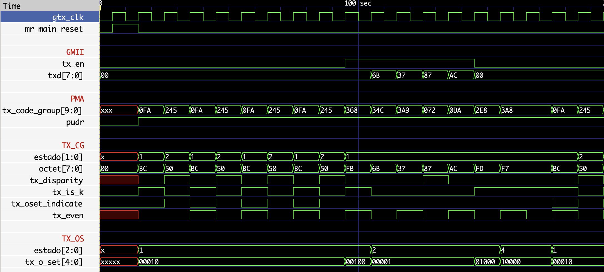
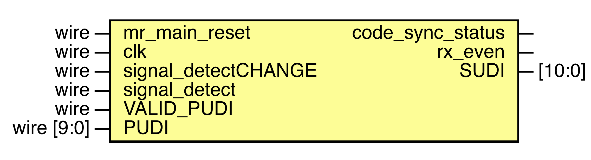
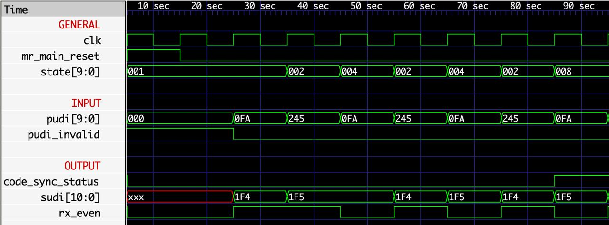
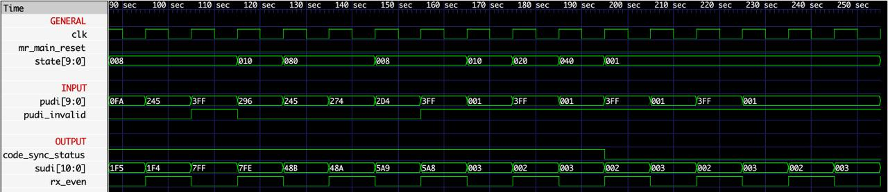
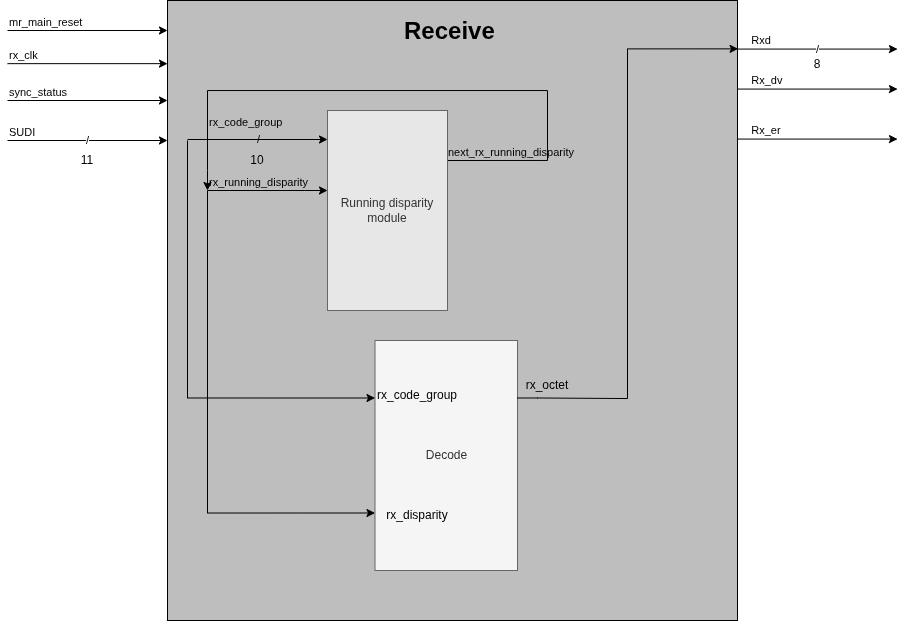
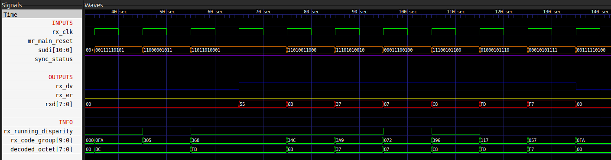
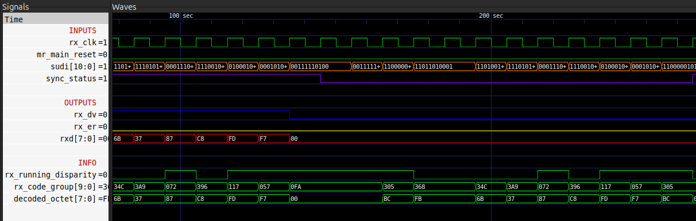
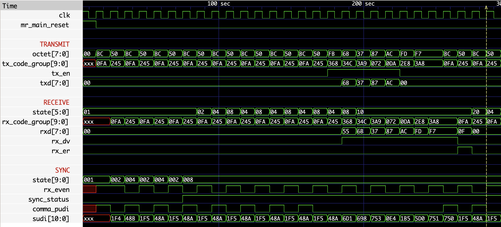
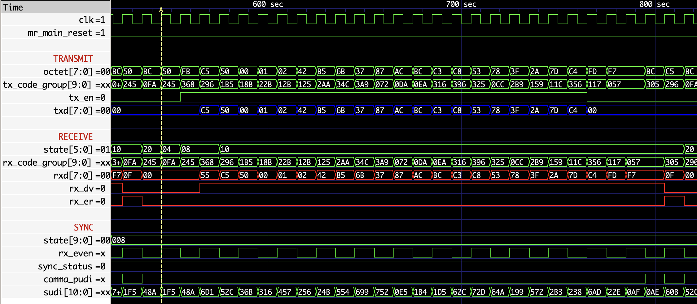

<div align="center">

<h2>Universidad de Costa Rica</h2>

<h1>Proyecto Final</h1>

<h2>Sistemas Digitales II</h2>

<h3>Grupo 02</h3>

---

### Integrantes

Brandon Jiménez Campos &nbsp;&nbsp;&nbsp;&nbsp;&nbsp;&nbsp;&nbsp; C33972  
Daniel Sáenz Obando &nbsp;&nbsp;&nbsp;&nbsp;&nbsp;&nbsp;&nbsp;&nbsp;&nbsp;&nbsp;&nbsp;&nbsp;&nbsp;&nbsp;&nbsp; C37099  
Rodrigo Sánchez Araya &nbsp;&nbsp;&nbsp;&nbsp;&nbsp;&nbsp;&nbsp;&nbsp;&nbsp;&nbsp;&nbsp;&nbsp;&nbsp; C37259

</div>
<br>
<br>
<br>
<br>
<br>
<br>
<br>
<br>
<br>
<br>

## Metodología

---

Para garantizar coherencia, calidad y un buen trabajo en paralelo, se utilizó.

1.  **Formato de código estandarizado**

> - Plantilla llamada `template.v` para tener una misma estructura.
> - Uso de la herramienta Verible para formateo automático y consistencia en todo el código.
> - Señales llamadas igual al estándar y en minúscula.
> - Nombres de estados en mayúscula.

<br>

2.  **Flujo de trabajo con GitHub**

> - Desarrollo por branches para funcionalidades aisladas.
> - Manejo de tareas mediante Issues.
> - Revisiones de código mediante Pull Requests.

<br>

3.  **Repartición de módulos**

> - Daniel Sáenz: Módulo Transmisor.
> - Rodrigo Sánchez: Módulo Sincronizador.
> - Brandon Jiménez: Modulo Receptor.

<br>
<br>
<br>
<br>
<br>
<br>
<br>
<br>
<br>
<br>

## Estructura del proyecto

---

La estructura de los archivos del proyecto se muestra a continuación:

```bash
.
├── docs/
├── LICENSE
├── README.md
└── src
    ├── constants
    │   ├── code_group_constants.v      # Code-groups definidos
    │   └── tx_o_set_constants.v        # Definiciones de tx_o_set
    ├── pcs
    │   ├── Makefile                    # Ejecutador pruebas del pcs
    │   ├── pcs.v                       # Wrapper para conexión loopback
    │   ├── testbench.v                 # Banco de pruebas pcs
    │   └── tester.v                    # Probador pcs
    ├── receive
    │   ├── decode.v                    # Decodificador 10b/8b
    │   ├── Makefile                    # Ejecutar pruebas receptor
    │   ├── receive.v                   # FSM del receptor
    │   ├── testbench.v                 # Banco de pruebas receptor
    │   └── tester.v                    # Probador receptor
    ├── running_disparity
    │   └── running_disparity.v         # Cálculo del siguiente rd
    ├── synchronization
    │   ├── Makefile                    # Ejecutar pruebas sync
    │   ├── pudi_checker.v              # Verificar si el PUDI existe o no
    │   ├── synchronization.v           # FSM del sync
    │   ├── testbench.v                 # Banco de pruebas sync
    │   └── tester.v                    # Probador sync
    ├── template.v                      # Plantilla para los archivos .v
    └── transmit
        ├── encode.v                    # Codificar 8b/10b
        ├── Makefile                    # Ejecutar pruebas transmit
        ├── testbench.v                 # Banco de pruebas transmit
        ├── tester.v                    # Probador transmit
        ├── transmit_code_group.v       # FSM de code_groups
        ├── transmit_ordered_set.v      # FSM de ordered_set
        └── transmit_wrapper.v          # Wrapper para todo el módulo de transmit
```

<br>
<br>
<br>
<br>
<br>
<br>
<br>
<br>
<br>
<br>

## Diagrama de bloques y resultados de pruebas individuales

---

### Módulo TRANSMIT

<p align="center">
    
    <br>
  <em>Figura 1. Diagrama de bloques del módulo TRANSMIT.</em>
</p>

<br>

#### Pruebas:

- **Prueba 0**: Envío de IDLEs

  Tras el `reset`, se espera un período de inactividad donde `tx_en = 0` y el transmisor permanece en estado de `IDLE`.

  <br>

- **Prueba 1**: Terminación con /T/R/R/ (_carrier extend_)

  Se habilita la transmisión (`tx_en = 1`), se envía una secuencia de datos y se desactiva la transmisión, lo que fuerza un `/T/` y se debe de producir un `carrier extend`. Se envía la siguiente secuencia de datos:

<p align="center">
  <code>D11_3, D23_1, D7_4, D12_5</code>
</p>

  <br>

- **Prueba 2**: Terminación sin _carrier extend_ y _running disparity_ positivo

  Se habilita la transmisión, se envía una secuencia de datos y se desativa la transmisión, esta combinación de datos está seleccionada para que el _running disparity_ al final de la trama sea **positivo**, pero sin requerir `carrier extend`. Se envía la siguiente secuencia:

<p align="center">
  <code>D11_3, D23_1, D7_4, D12_5, D8_6</code>
</p>

- **Prueba 3**: Terminación con _running disparity_ negativo

  Se habilita la transmisión, se envía una secuencia de datos y se desactiva la transmisión, en este caso, la combinación de datos se seleccionó para que el _running disparity_ al final de la trama sea **negativo**. Se envía la siguiente secuencia:

<p align="center">
  <code>D11_3, D23_1, D1_0, D31_1</code>
</p>

<br>

<p align="center">
  
  <br>
  <em>Figura 2. Prueba del módulo TRANSMIT.</em>
</p>

---

### Módulo SYNCHRONIZATION

<p align="center">
    
    <br>
  <em>Figura 3. Diagrama de bloques del módulo SYNCHRONIZATION.</em>
</p>

<br>

#### Pruebas:

- **Prueba 1**:
  Corroborar la correcta sincronización al recibir una secuencia de comas deseada, entrando así en el estado de sincronización.

  <br>

- **Prueba 2**:
  Corroborar el ingreso correcto a los estados de caracteres inválidos ante la entrada de códigos inválidos.

<br>

<p align="center">
  
  <br>
  <em>Figura 4. Sincronización exitosa del módulo SYNCHRONIZATION.</em>
</p>

<br>
<br>

<p align="center">
  
  <br>
  <em>Figura 5. Detección de error en el módulo SYNCHRONIZATION.</em>
</p>

<br>
<br>

---

### Módulo RECEIVE

<p align="center">
    
    <br>
  <em>Figura 6. Diagrama de bloques del módulo RECEIVE.</em>
</p>

<br>

#### Pruebas:

- **Prueba 1**:
  El receptor entra en estado sincronizado y recibe el ordered set `/S/` y procede con la decodificación de los datos, enviándolos posteriormente a la interfaz GMII.

  <br>

- **Prueba 2**:
  El receptor no está sincronizado, por lo que el receptor no debe entregar datos a la interfaz GMII.

  <br>

- **Prueba 3**:
  En esta prueba se fuerza un escenario incorrecto donde la terminación recibida es `/T/R/R/`.

<br>

<p align="center">
  
  <br>
  <em>Figura 7. Prueba de recepción.</em>
</p>

<br>
<br>

<p align="center">
  
  <br>
  <em>Figura 8. No se encuentra sincronizado.</em>
</p>

<br>
<br>

<br>
<br>
<br>
<br>
<br>
<br>
<br>
<br>
<br>

## Resultados en conjunto

---

Como prueba se utilizó un tester similar al del transmisor, ya que este es el que genera los code groups.

<p align="center">
  
  <br>
  <em>Figura 9. Prueba loopback y sincronización.</em>
</p>

<p align="center">
  
  <br>
  <em>Figura 10. Prueba loopback con los 20 code-groups seleccionados.</em>
</p>

<br>
<br>
<br>
<br>
<br>
<br>
<br>
<br>
<br>
<br>
<br>
<br>

## Conclusiones y Recomendaciones

---

## Conclusiones

- La metodología empleado permitió avanzar rápido y mantener coherencia entre los tres bloques: Transmisor, Sincronizador y Receptor.
  <br>
- Al integrar los 3 módulos simplificados se verificó el correcto funcionamiento, cumpliendo así la cláusula 36 del estándar IEEE 802.3.
  <br>
- El manejo del _running disparity_ y la lógica de los code groups funcionó correctamente tanto en pruebas individuales como en la simulación completa.
  <br>

- El uso de GitHub permitió un trabajo ordenado, sin conflictos y con integración sencilla entre módulos.
  <br>

## Recomendaciones

- Realizar la sintetización de los módulos.
  <br>

- Explorar la implementación del bloque de Auto-Negotiation.
