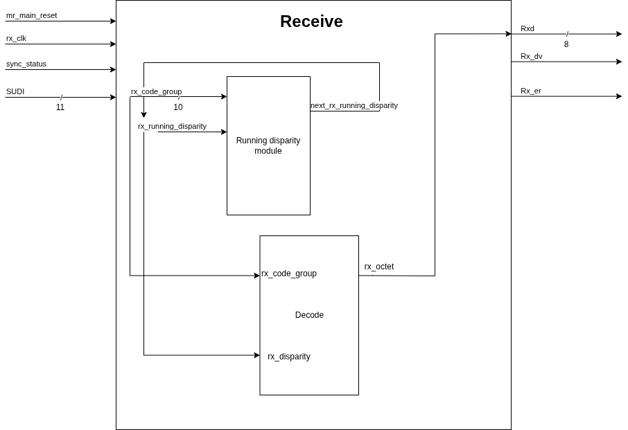
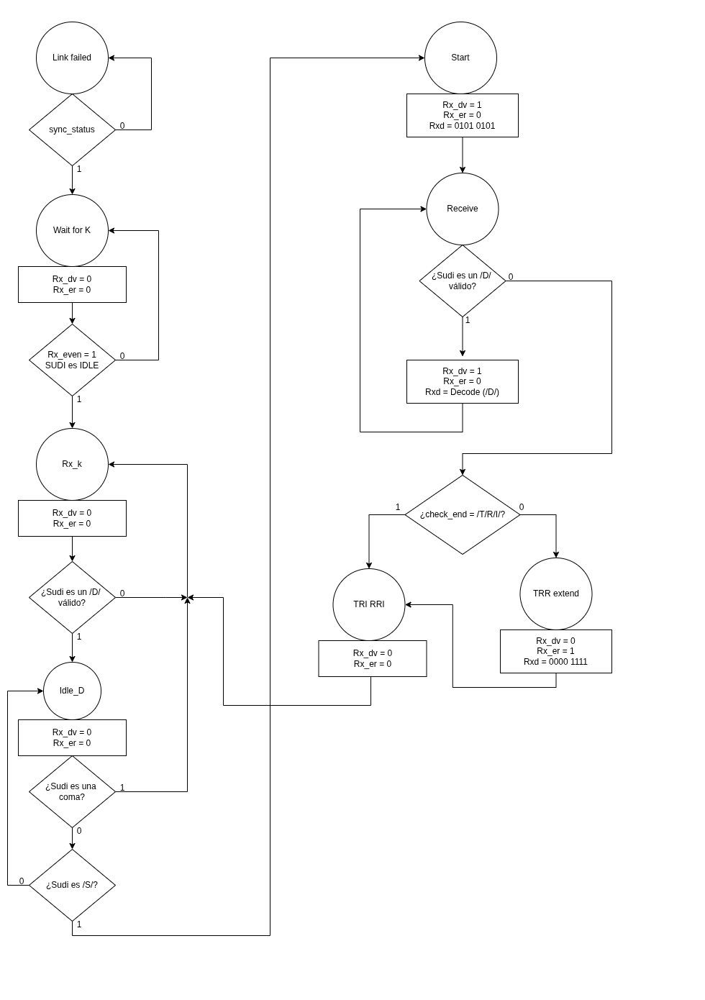

# RECEIVE

En el bloque de receive, se tiene el siguiente bloque para entender mejor las salidas y las entradas.

En donde cada señal tiene su significado e importancia

|    Nombre de la señal     | Tipo de señal | Descripción                                                                                                                                                                                                                                                         |
| :-----------------------: | :-----------: | ------------------------------------------------------------------------------------------------------------------------------------------------------------------------------------------------------------------------------------------------------------------- |
|       mr_main_reset       |    Entrada    | Controla el reinicio del PCS, si mr_main_reset = 0 significa que no se reinicia el PCS, sin embargo, si se tiene mr_main_reset = 1 se reinicia el PCS.                                                                                                              |
|        SUDI [10:0]        |    Entrada    | Señal enviada por el proceso de sincronización al proceso de recepción que contiene los parámetros del code_group y también el rx_even, el cual si rx_even = 1 significa que se recibe un grupo de códigos par, caso contrario se recibe un grupo de códigos impar. |
|          rx_clk           |    Entrada    | Reloj con el que funciona el receptor para el envio de datos.                                                                                                                                                                                                       |
|        sync_status        |    Entrada    | Si sync_status = 1, significa que se está sincronizado y que los datos que se van a recibir son fiables.                                                                                                                                                            |
|         Rxd [7:0]         |    Salida     | Es el valor que entrega el receptor a la interfaz GMII.                                                                                                                                                                                                             |
|           Rx_dv           |    Salida     | Señal que indica que los valores de Rx son válidos.                                                                                                                                                                                                                 |
|           Rx_er           |    Salida     | Señal que indica que los valores de Rx contienen un error.                                                                                                                                                                                                          |
|       rx_code_group       |    Interna    | Son los 10 bits más significativos y estos son los datos codificados                                                                                                                                                                                                |
|   rx_running_disparity    |    Interna    | Es el bit que se encarga de decir si se tiene un running disparity positivo o negativo, si es 1 es positivo y si tiene un valor de 0 es negativo.                                                                                                                   |
| next_rx_running_disparity |    Interna    | Indica el running disparity del siguiente dato.                                                                                                                                                                                                                     |
|         rx_octet          |    Interna    | Son los datos ya codificados, los que van a ser enviados a través de Rxd.                                                                                                                                                                                           |

Ahora, para la máguina de estados se tienen planteados los siguientes estados, utilizando la codificación One-Hot

|   Estado    | Codificación del estado |
| :---------: | :---------------------: |
| Link failed |        00000001         |
| Wait for K  |        00000010         |
|    Rx_K     |        00000100         |
|   Idle_D    |        00001000         |
|    Start    |        00010000         |
|   Receive   |        00100000         |
| TRR_Extend  |        01000000         |
|   TRI_RRI   |        10000000         |

Para el bloque de recepción se utilizará la máquina de estados que se presenta en el siguiente diagrama asm.

