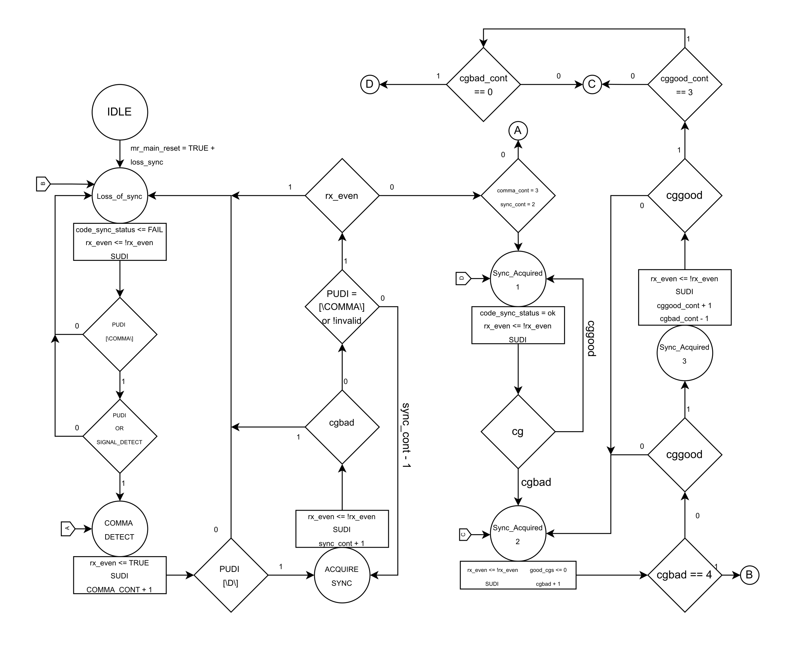

# SYNCHRONIZATION

### Entradas y Salidas del sistema (Descripción y Tipo)

| Nombre                  | Dirección | Tipo | Ancho   | Descripción                                                                            |
| ----------------------- | --------- | ---- | ------- | -------------------------------------------------------------------------------------- |
| **mr_main_reset**       | Entrada   | wire | 1 bit   | Reset maestro activo en bajo. Inicializa el sistema y fuerza el estado IDLE.           |
| **clk**                 | Entrada   | wire | 1 bit   | Señal de reloj principal del sistema.                                                  |
| **signal_detectCHANGE** | Entrada   | wire | 1 bit   | Indica cambios en la señal detectada para evaluar pérdida de sincronía.                |
| **signal_detect**       | Entrada   | wire | 1 bit   | Indica si el medio físico ha detectado una señal válida.                               |
| **VALID_PUDI**          | Entrada   | wire | 1 bit   | Indica que el code-group recibido en PUDI es válido. Proviene del bloque PUDR.         |
| **PUDI**                | Entrada   | wire | 10 bits | Code-group recibido desde el PCS (10b).                                                |
| **code_sync_status**    | Salida    | reg  | 1 bit   | Indica sincronización adquirida: 1 = sincronizado, 0 = pérdida de sincronía.           |
| **rx_even**             | Salida    | reg  | 1 bit   | Indica si el code-group debe ser procesado en posición par según IEEE 802.3 (rx_even). |
| **SUDI**                | Salida    | reg  | 11 bits | Code-group extendido a 11 bits (PUDI + rx_even).                                       |

---

#### Diagrama de entradas y salidas:

### Tabla de estados

| Estado              | Código (Hot-One) | Descripción                                                                                                  |
| ------------------- | ---------------- | ------------------------------------------------------------------------------------------------------------ |
| **IDLE**            | 0000001          | Estado inicial. El sistema espera una condición de pérdida de sincronía. No se procesan code-groups aún.     |
| **LOSS_OF_SYNC**    | 0000010          | Indica pérdida de sincronización. Se espera la aparición de una comma /K28.5/ válida para intentar recuperar |
| **COMMA_DETECT**    | 0000100          | Se detecta la comma por primera vez. Verifica que el siguiente code-group sea un D válido.                   |
| **ACQUIRE_SYNC**    | 0001000          | Proceso de adquisición de sincronía. Cuenta commas y code-groups válidos para decidir si sincronizarse.      |
| **SYNC_ACQUIRED_1** | 0010000          | Primer nivel de sincronización establecida. rx_even alterna y se valida la calidad de los code-groups.       |
| **SYNC_ACQUIRED_2** | 0100000          | Estado intermedio. Se monitorean bad_cg_cont y cg para decidir si perder o reforzar sincronía.               |
| **SYNC_ACQUIRED_3** | 1000000          | Última etapa de operación sincronizada. Se busca estabilidad: good_cg_cont y bad_cg_cont definen transición. |

### Diagrama ASM del Synchronization state machine.

