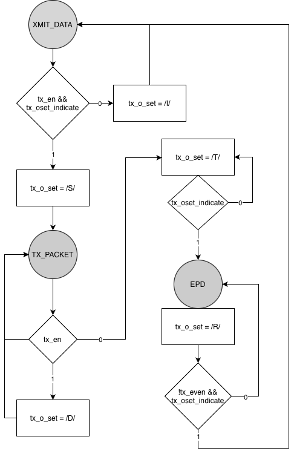
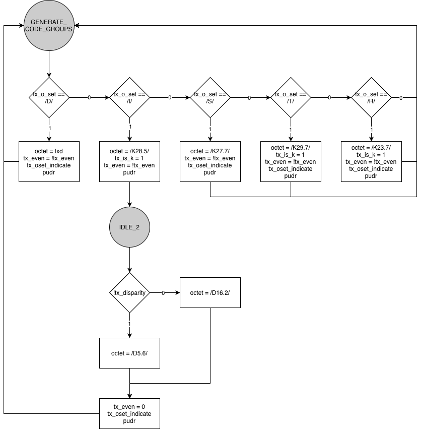

# TRANSMIT

En este documento, se muestra la documentación realizada para el módulo `transmit`, correspondiente al transmisor de la capa PCS (_Physical Coding Sublayer_) para 1000BASE-X, según la cláusula 36 del estándar IEEE 802.3.

## Estructura del proyecto

```bash
.
├── encode.v
├── Makefile
├── testbench.v
├── tester.v
├── transmit_code_group.v
├── transmit_ordered_set.v
└── transmit_wrapper.v
```

## Diagrama arquitectónico del transmisor

<p align="center">
    
</p>

## Módulo `transmit_code_group`

El módulo `transmit_code_group` recibe:

- El ordered set o tipo de code-group a enviar (`tx_o_set`).
- El octeto de datos (`txd`) cuando el ordered set corresponde a `/D/`.

A partir de esto, el módulo:

- Selecciona el octeto apropiado (datos, `/S/`, `/T/`, `/R/`, `/I/`).
- Indica si el símbolo corresponde a un carácter de tipo K (`tx_is_k`) para la codificación 8b/10b.
- Controla el **running disparity** mediante el módulo `running_disparity`.
- Actualiza la señal `tx_even` para distinguir ciclos pares e impares.
- Genera el code-group 8b/10b de 10 bits en `tx_code_group`.
- Activa `tx_oset_indicate` cuando el code-group queda listo para `transmit_ordered_set`.
- Activa `pudr` cuando el code-group se encuentra disponible para la capa PMA.

### Diagrama ASM

<p align="center">
    
</p>

### Señales de `transmit_code_group`

| Señal                           | Tipo    | Descripción                                                                                          |
| ------------------------------- | ------- | ---------------------------------------------------------------------------------------------------- |
| `gtx_clk`                       | Entrada | Reloj de transmisión del bloque PCS.                                                                 |
| `mr_main_reset`                 | Entrada | Reinicio global del transmisor, activo en alto.                                                      |
| `txd [OCTET_WIDTH-1:0]`         | Entrada | Octeto de datos a transmitir cuando `tx_o_set` indica `/D/`.                                         |
| `tx_o_set [TX_O_SET_WIDTH-1:0]` | Entrada | Identificador del tipo de ordered set (`/I/`, `/S/`, `/D/`, `/T/`, `/R/`).                           |
| `tx_code_group [CG_WIDTH-1:0]`  | Salida  | Code-group que se envía hacia la capa PMA.                                                           |
| `tx_even`                       | Salida  | Indicador de ciclo par/impar.                                                                        |
| `tx_oset_indicate`              | Salida  | Señal que indica que el code-group actual se encuentra listo para que `transmit_ordered_set` avance. |
| `pudr`                          | Salida  | Señal de indicación hacia la PMA de que existe un nuevo code-group disponible en `tx_code_group`.    |

## Módulo `transmit_ordered_set`

El módulo `transmit_ordered_set` se encarga de:

- Permanecer en estado de **IDLE** (`/I/`) cuando la transmisión no se habilita.
- Detectar el inicio de una trama cuando `tx_en` se activa y emitir `/S/` (_Start of Packet_).
- Emitir `/D/` mientras existan datos válidos.
- Emitir `/T/` al final de la trama y decidir si aplica _carrier extend_ mediante `/R/`, según el valor de `tx_even`.

### Diagrama ASM

<p align="center">
    
</p>

### Señales de `transmit_ordered_set`

| Señal                           | Tipo    | Descripción                                                                    |
| ------------------------------- | ------- | ------------------------------------------------------------------------------ |
| `gtx_clk`                       | Entrada | Reloj de transmisión del bloque PCS.                                           |
| `mr_main_reset`                 | Entrada | Reinicio global del transmisor, activo en alto.                                |
| `tx_even`                       | Entrada | Indicador de ciclo **par/impar** para decidir la aplicación de carrier extend. |
| `tx_oset_indicate`              | Entrada | Señal que indica que el **code group actual ya se envió**.                     |
| `tx_en`                         | Entrada | Habilitación de transmisión.                                                   |
| `tx_o_set [TX_O_SET_WIDTH-1:0]` | Salida  | Identificador del ordered set a enviar (`/I/`, `/S/`, `/D/`, `/T/`, `/R/`).    |
